# Movies-info Web application
`owner`\
this project is made by Moataz Bahaa

## you can see project live [here](https://moataz-bahaa.github.io/movie-info)

## libraries && technologies
  `HTML`
  `CSS`
  `javaScirpt`
  `bootstrap`
  `react`
  `redux`
  `firebase`

## run project on you device
  to run project in your device use
  ```npm install```
  to install all packges then
  ```npm start```

## description
  the project is all about movies watching movies (only trailer)
  search for movies and son on


## let take a quick tour in the app
# sign in page
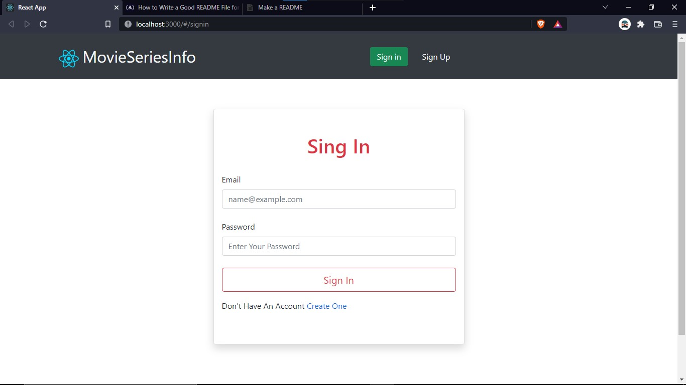
# signup page
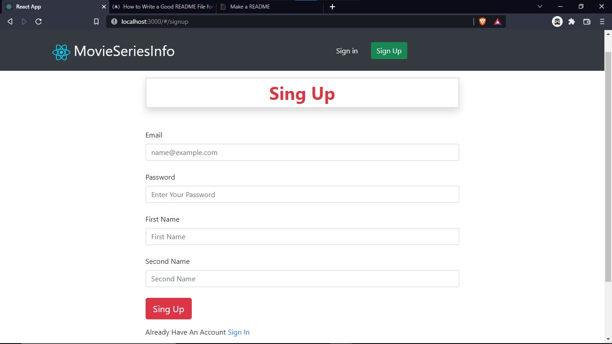
## if enered in valid info we get an error
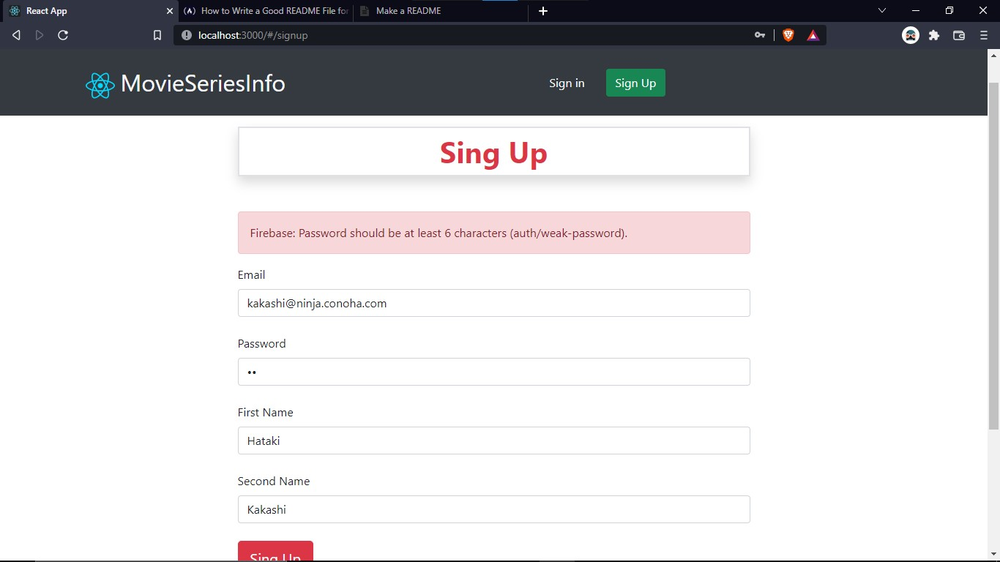
# home page with load more info button
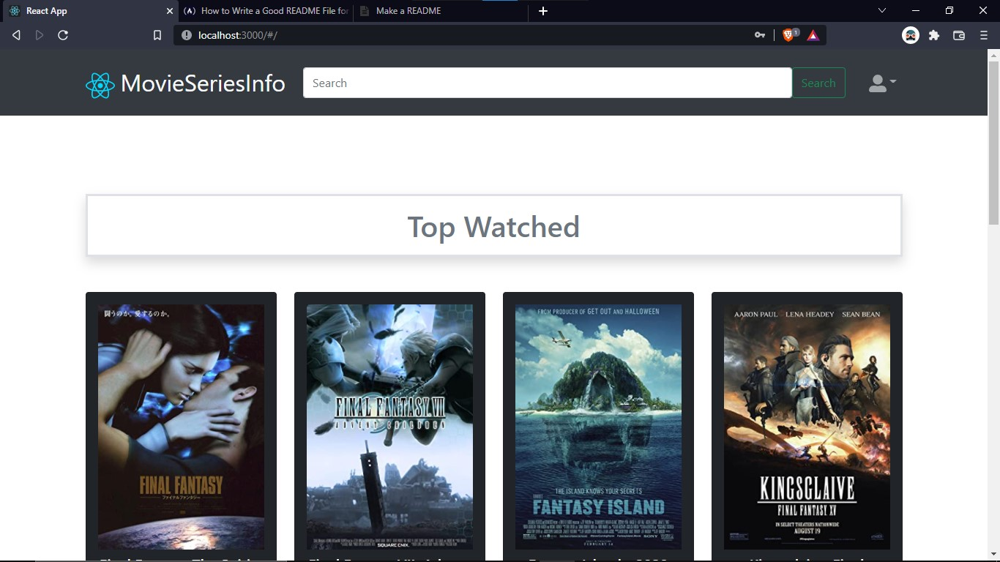

# search page for harry potter
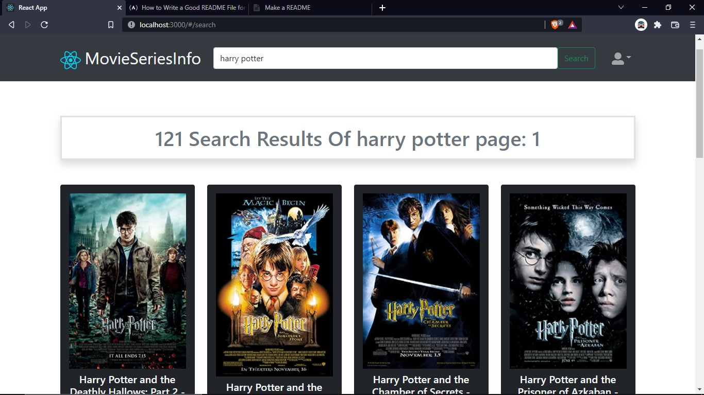
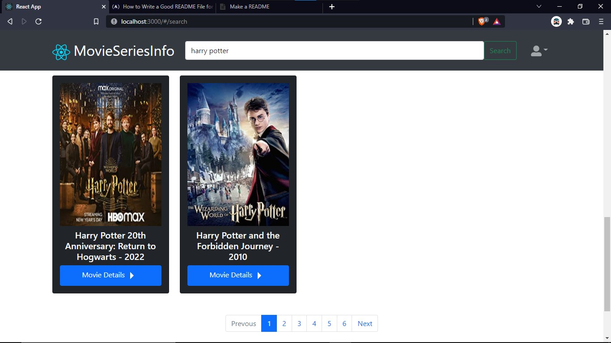
# harry potter movie page datails and trailer
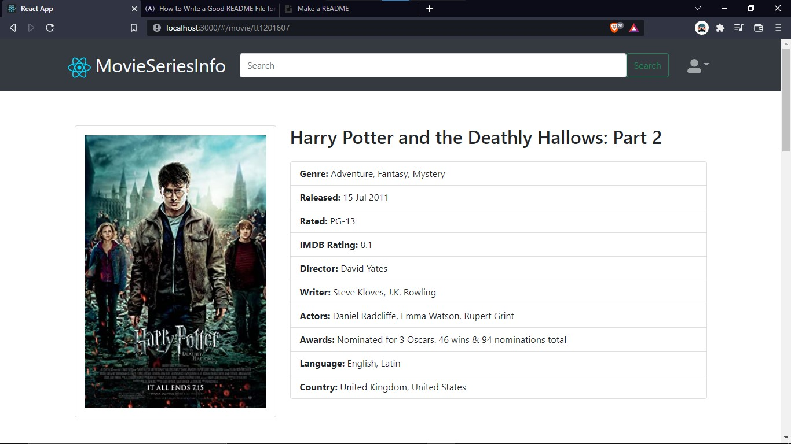


# profile and update profile info & image
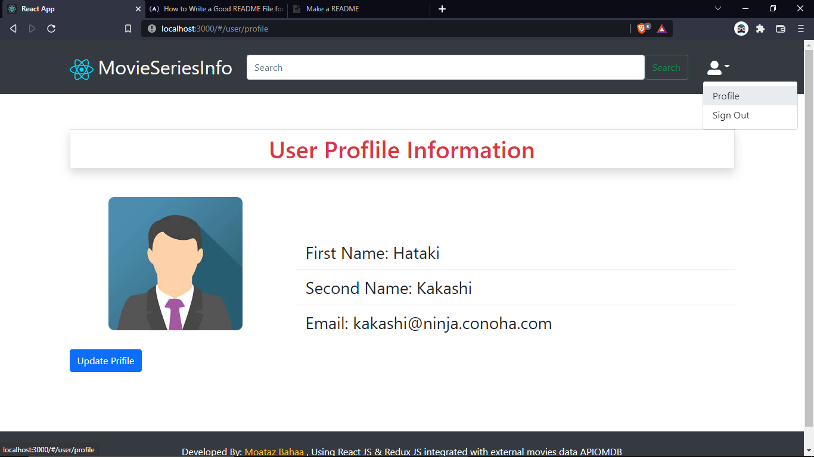
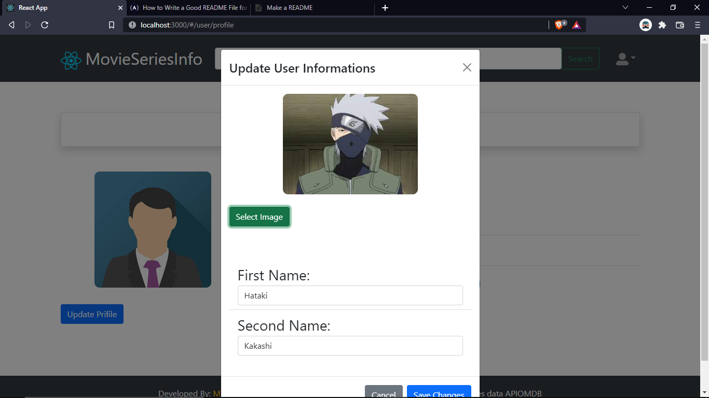
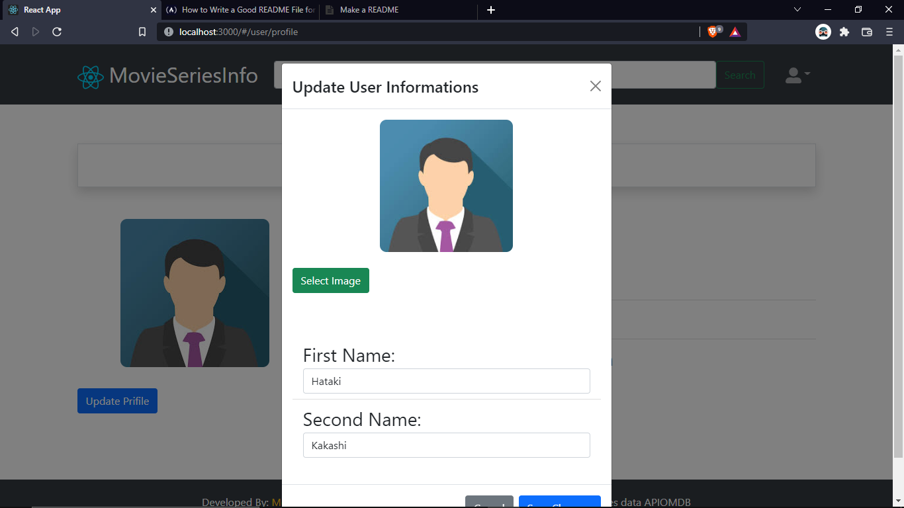
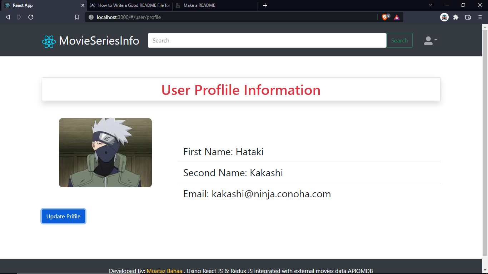